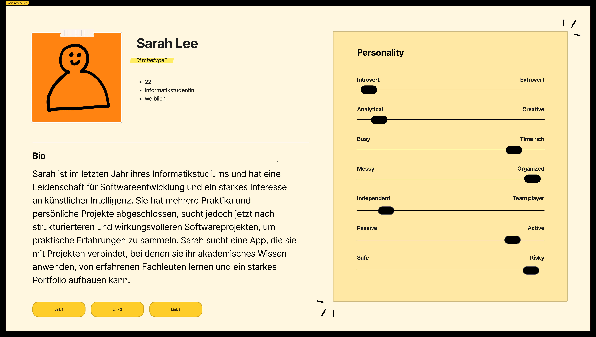

# Personas

## Available Tags

### Knowledge
`#knowledge-beginner` `#knowledge-intermediate` `#knowledge-advanced`

### Wonach wird gesucht?
`#sucht-Teammitglieder`
`#sucht-projekt`

### Steht das Thema?
`#thema-festgelegt`
`#thema-offen`

### Context
`#context-legere`
`#context-professionell`

### Motiv
`#motiv-learning`
`#motiv-support`
`#motiv-portfolio`
`#motiv-netzwerken`

### Team Zusammensetzung
`#team-homogen`
`#team-mixed`

## Jonas

`#sucht-projekt`
`#knowledge-beginner`
`#thema-offen`
`#context-legere`
`#motiv-learning`
`#team-homogen`

## Marie

`#knowledge-Intermediate`
`#thema-festgelegt`
`#sucht-teammitglieder`
`#context-professionell`
`#motiv-support`
`#team-mixed`

## ~~Steffen~~

`#thema-festgelegt`
`#sucht-teammitglieder`
`#context-professionell`

## Danny

`#sucht-projekt`
`#knowledge-Intermediate`
`#thema-offen`
`#context-professionell`
`#motiv-portfolio`

## Clara

`#thema-festgelegt`
`#sucht-teammitglieder`
`#knowledge-Profi`
`#context-professionell`
`#motiv-support`
`#team-homogen`

## Felix

`#team-mixed`
`#motiv-netzwerken`
`#motiv-portfolio`
`#thema-offen`
`#knowledge-Intermediate`
`#context-professionell`
`#context-legere`

## ~~Marc~~

`#thema-offen`
## James

`#motiv-support`
`#motiv-netzwerken`
`#sucht-projekt`
`#thema-offen`
`#knowledge-Profi`
`#context-professionell`
## Sarah Lee

`#sucht-projekt`
`#team-homogen`
`#thema-offen`
`#knowledge-Intermediate`
`#motiv-learning`
`#context-professionell`
