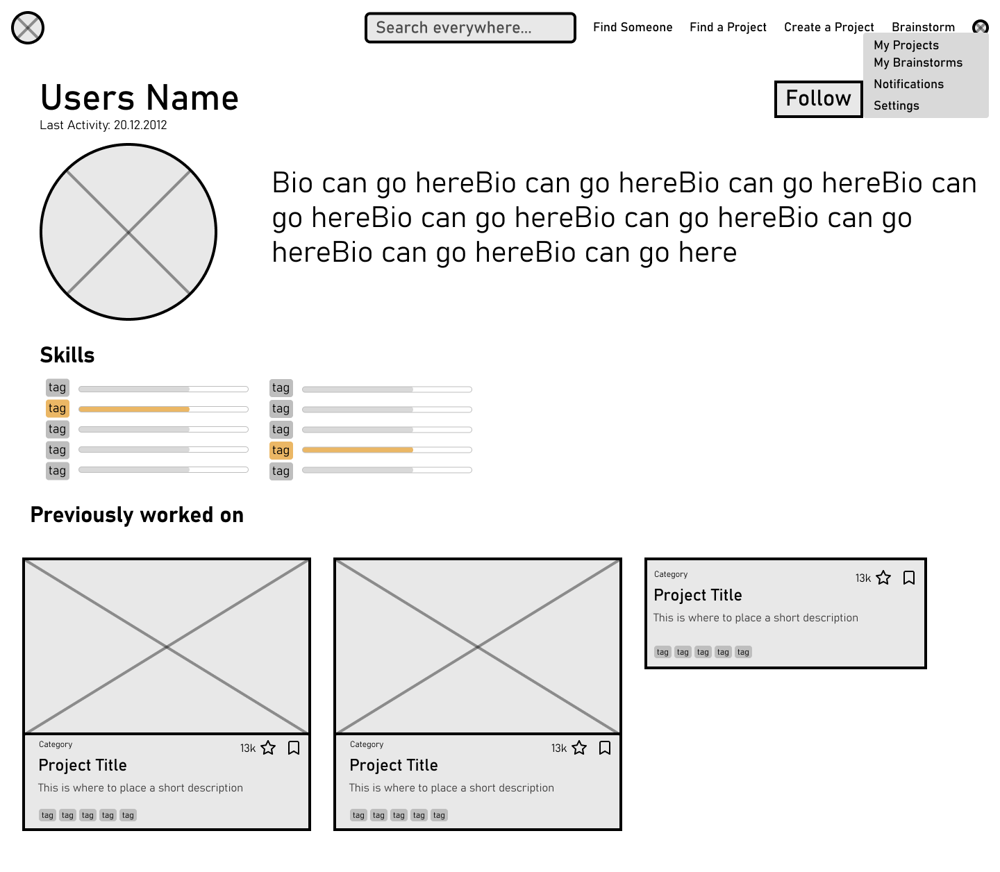
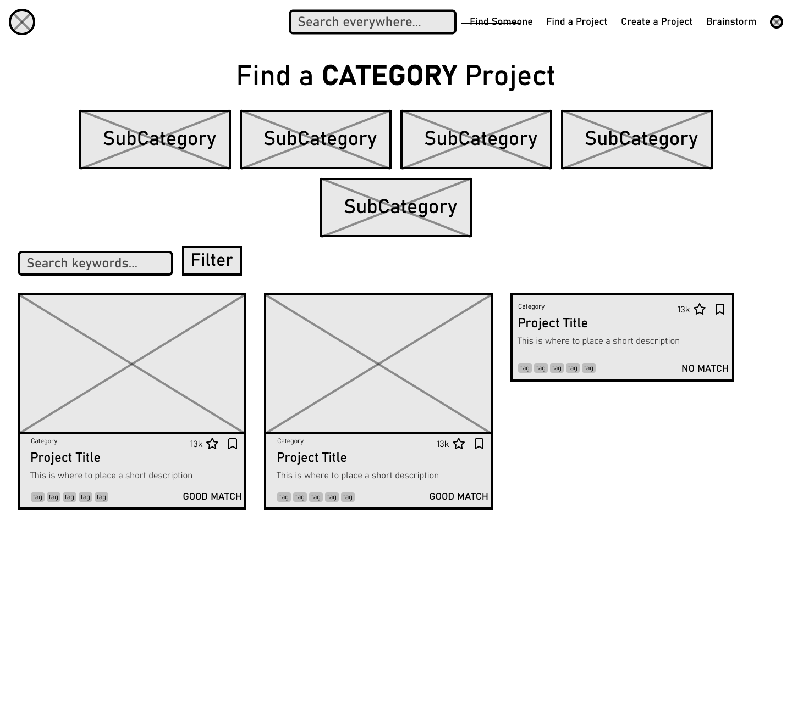
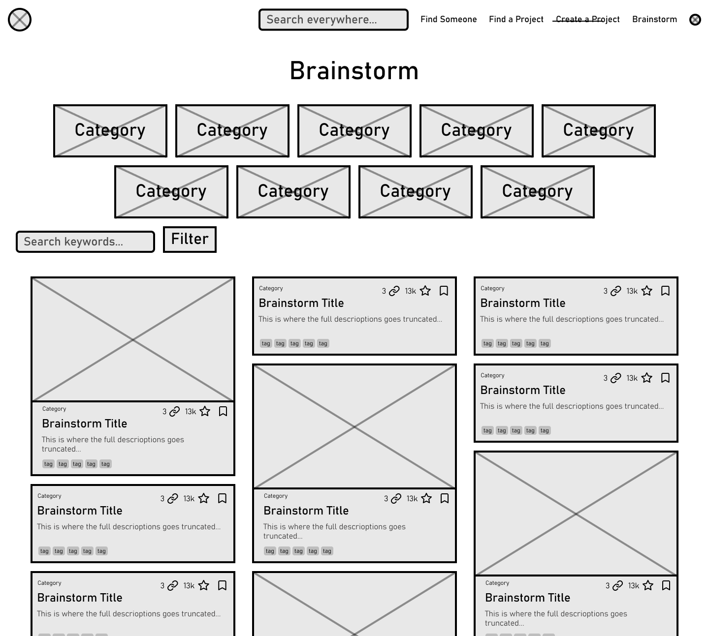

# Wireframes

Auf Basis der Anforderungen und Erfordernisse, den User Stories sowie der HTA wurden Wireframes erstellt, um die
Interaktionen zwischen Benutzer und System rudimentär zu visualisieren. Die Wireframes sind eine wichtige Grundlage für die
Entwicklung des Designs und der Benutzeroberfläche. Sie helfen dabei, die Anforderungen an das System besser zu
verstehen und zu definieren und dienen als Vorlage für die Erstellung von Design-Prototypen. 
Sie wurden von uns mithilfe des Tools Figma erstellt.

Die Wireframes sind im Folgenden aufgeführt:

---

Die Landing Page des Tools. Sie enthält drei "Call to Action" Sektionen, über die sich die Bereiche Projektsuche, Projekterstellung und Brainstorming erreichen lassen.

---

Das öffentliche Profil eines Nutzers. Hier sind Informationen über den Nutzer, seine Projekte und seine Skills sichtbar.

---

Die Projektsuche. Hier können Nutzer Projekte nach verschiedenen Kriterien filtern und suchen, oder eine Kategorie auswählen.

Dies ist eine Unterseite einer Kategorie, in welcher Projekte nach Subkategorien gefiltert werden können.

Die Detailansicht eines Projektes. Hier sind alle relevanten Informationen zu einem Projekt sichtbar.
Das Layout dieser Seite lässt sich planmäßig durch den Projektersteller detailliert anpassen.

---

Die Seite zur Erstellung eines Projektes. Zunächst wird ein Name vergeben und ein Layout ausgewählt.

Auf der Seite können dann weitere Informationen zum Projekt hinzugefügt werden. 
Der Projektersteller kann hier einzelne Abschnitte hinzufügen und bearbeiten.

---

Die Übersichtsseite von Brainstorming-Ideen. Hier können Nutzer eigene Ideen einreichen und die Ideen anderer Nutzer bewerten.
Sie ist ähnlich aufgebaut wie die Projektsuche.

Die Detailansicht einer Brainstorming-Idee. Hier sind alle relevanten Informationen sichtbar.
Im Gegensatz zu Projekten werden Brainstorms in einem "Modal" dargestellt.

---

Das Dashboard eines Projektes. Hier sind alle relevanten Informationen und Funktionen für den Projektersteller sichtbar.
Auch Projektbewerbungen und -anfragen können hier verwaltet werden.

Die Seite zur Suche nach neuen Mitgliedern für ein Projekt. Hier können Projektersteller nach passenden Mitgliedern suchen und diese einladen.
Hilfestellung dabei ist der "Match Score", der die Übereinstimmung der Skills eines Nutzers mit den Anforderungen des Projektes anzeigt.

---

Eine Suche, um nach Profilen anderer Nutzer zu suchen. Hier können Nutzer nach Skills gefiltert werden.
