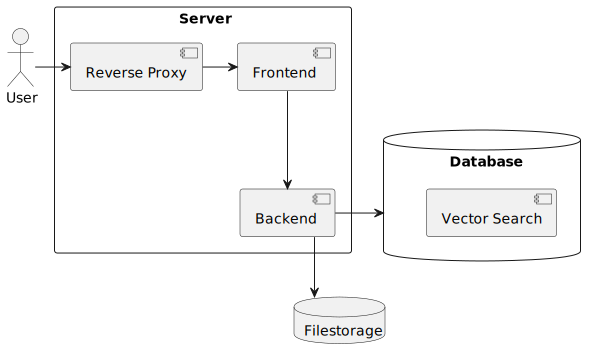

# Architektur

Dieses Dokument fasst die Entscheidungen zusammen die für die Architektur des zukünftigen Systems getroffen wurden. Dabei wurde sich für eine simple Monolith Architektur entschieden mit eine Frontend Anwendung fürs Interface, ein Backend für die Logik und einer zentralen Datenbank. Zusätzlich wurde sich noch dafür entschieden einen Reverse Proxy als Loadbalancer einzusetzen und neben der Datenbank noch einen dedizierten Filestorage für Projekt Media, wie Bilder, Videos oder Dokumente.

Ziel der Architektur ist es eine simple Struktur für die spätere Implementation zu bieten um nicht benötigte Komplexität zu vermeiden.

Für die einzelnen Teile der Architektur wurden auch Technologien vorgeschlagen und in Form von Architecture Decision Records aufgeschrieben.

## Architecture Decision Records

Die folgenden ADRs begründen die Empfehlung spezifischer Technologien in der beschriebenen Architektur.

- [Reverse Proxy](adr/001_reverse_proxy.md)
- [Frontend](adr/002_frontend.md)
- [Backend](adr/003_backend.md)
- [Database](adr/004_database.md)
- [Filestorage](adr/005_filestorage.md)
