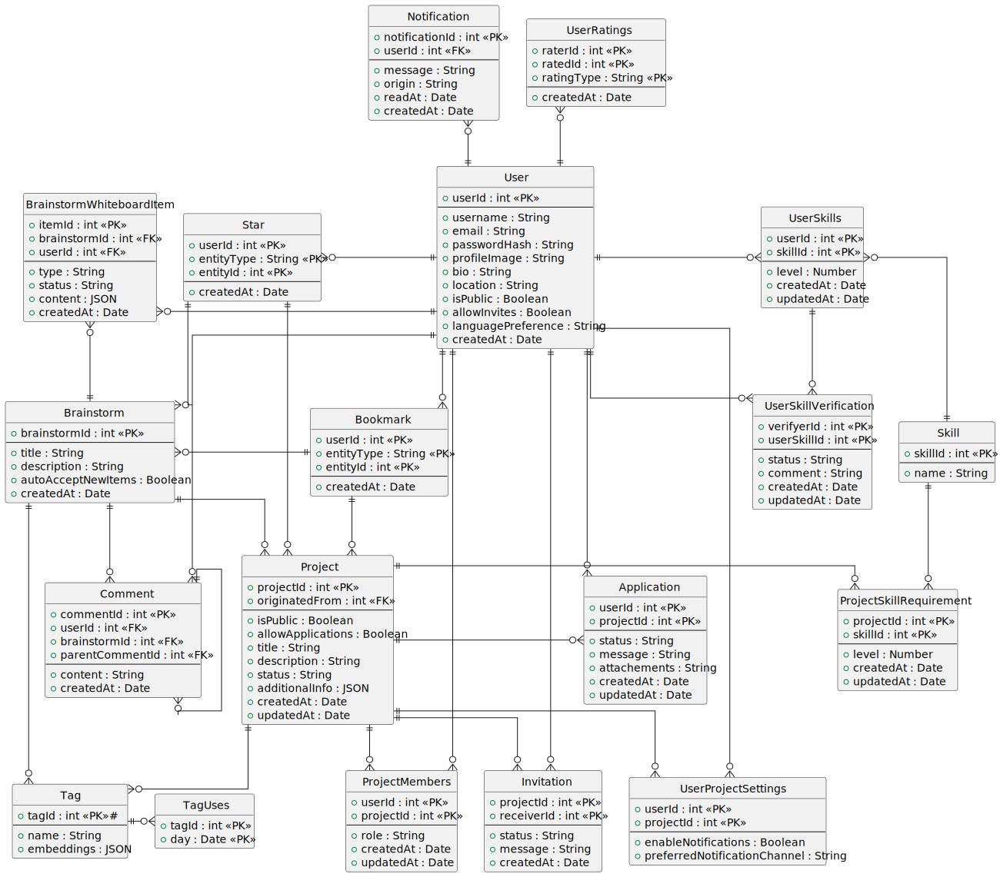

# Entity Relationship Diagram

Das Entity Relationship Diagram (ERD) visualisiert die wichtigsten Entitäten des Systems und deren Beziehungen, um die Struktur der Datenbank für das Projekt darzustellen. Jede Entität repräsentiert eine separate Komponente des Systems, und ihre Attribute zeigen die Datenfelder, die für diese Entität gespeichert werden. Das Diagramm bietet einen klaren Überblick darüber, wie die Entitäten interagieren, sowie über die Kardinalität dieser Beziehungen (eins-zu-eins, eins-zu-viele oder viele-zu-viele).

Dies ist die Funktion der jeweiligen Entitäten

- **User**: Eine der zentralen Entitäten, welche einen Benutzer im System darstellt. Ein Nutzer kann Teil mehrerer Projekte (`Project`) oder Brainstorms (`Brainstorm`) sein, kann Benachrichtigungen (`Notification`) erhalten und sich für Projekte bewerben (`Application`), eingeladen werden (`Invitation`) oder diese abspeichern (`Bookmark`).
- **UserRating**: Nutzer können sich gegenseitig für besondere Arbeit in bestimmten Kategorien loben, diese werden als Rating abgespeichert. Daraus können dann später Abzeichen für einzelne Nutzer generiert werden.
- **Project**: Eine der zentralen Entitäten, welche ein Projekt im System darstellt. Es kann aus einem Brainstorm erstellt werden (`Project.originatedFrom`) und speichert alle wichtigen Informationen um das Projekt im Interface darzustellen. Projekte können mit Sternen (`Star`) bewertet werden und speichern auch die Mitgliedschaft von Nutzern (`ProjectMembers`).
- **UserProjectSettings**: Hiermit können Nutzer spezifisch für ein Project bestimmte Einstellungen bezüglich Benachrichtigungen speichern.
- **ProjectMembers**: Stellt die Verbindung von einem Nutzer zu einem bestimmten Projekt dar, weiter wird auch die Rolle in diesem Projekt für das bestimmen von Zugriffsrechten gespeichert.
- **Skill und UserSkills**: Ein Skill beschreibt eine generelle Fähigkeit die es in dem System gibt, sie werden einzeln gespeichert um Nutzern beim eintragen ihrer UserSkills eine Vorauswahl geben zu können. UserSkills sind verbunden mit einem Skill im System und legen für einen bestimmten Nutzer ein Level fest welches die Stärke darstellt. UserSkills können auch von anderen Nutzern bestätigt werden (`UserSkillVerification`). Umgekehrt kann auch ein Projekt verschiedene Skills als ProjectSkillRequirement festhalten um anzugeben welche Skills für das Projekt erforderlich sind.
- **Application und Invitation**: Hier wird gespeichert wenn ein Nutzer sich über die Plattform für ein Projekt bewirbt oder wenn ein Project von sich aus eine Einladung für einen Nutzer ausspricht.
- **Tags und TagUses**: Tags werden verwendet um Projekte und Brainstorms zu kategorisieren und filterbar zu machen. Für die Tags werden außerdem Embeddings gespeichert um eine Semantische Suche zu erlauben. Um weiter auch Populäre Tags abbilden zu können wird auch gespeichert welche Tags zu welche Zeitpunkt viel verwendet werden.
- **Notifications**: Innerhalb der Plattform können auch Benachrichtigungen verschickt werden, diese enthalten eine Nachricht und können noch angeben wodurch diese erstellt worden sind (`Notification.origin`).
- **Bookmarks**: Hiermit können Nutzer Projekte und Brainstorms für später abspeichern.
- **Brainstorm und BrainstormWhiteboardItem**: Ein Brainstorm bildet häufig die Vorstufe zu einem Projekt und speichert Ideen ab. Nutzer können diese dann kommentieren (`Comment`) oder auch über ein gemeinsames Whiteboard Ideen teilen und erweitern. Die BrainstormWhiteboardItems werden separat gespeichert um moderation zu erlauben, dadurch kann man einzelne Items verstecken wenn diese nicht den Richtlinien entsprechen.
- **Comment und Star**: Mit diesen Entitäten können Nutzer auf Brainstorms und Projekte reagieren. Kommentare sind vorerst nur für Brainstorms geplant, aber beides kann mit einem Stern versehen werden um Befürwortung zu vermitteln.

Dieses ERD dient als umfassender Überblick über die im System verwendeten Entitäten und stellt sicher, dass die Beziehungen zwischen Benutzern, Projekten, Fähigkeiten und anderen Elementen klar definiert und effizient miteinander verknüpft sind. Es zeigt auch, wie verschiedene Funktionalitäten wie Bewertungen, Bewerbungen, Benachrichtigungen und Zusammenarbeit innerhalb des Systems strukturiert sind.
