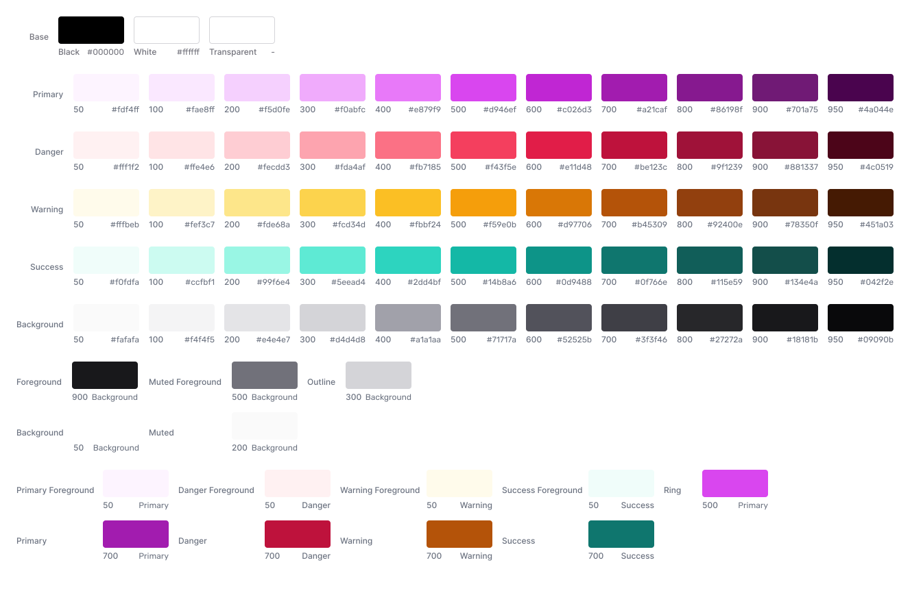
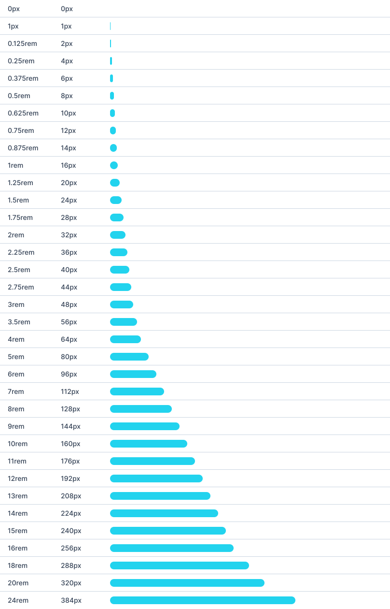
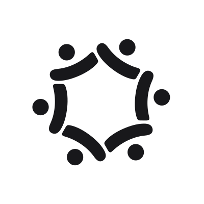
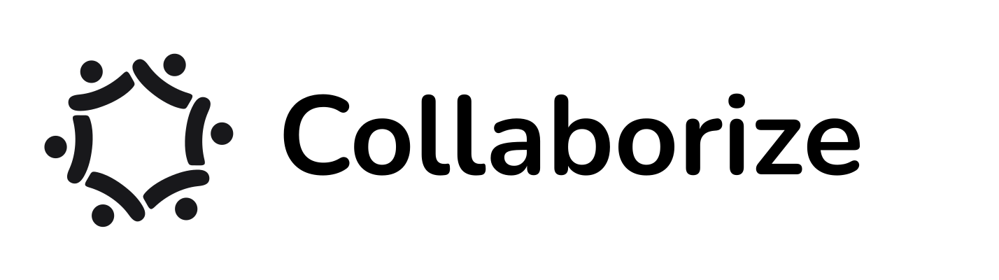
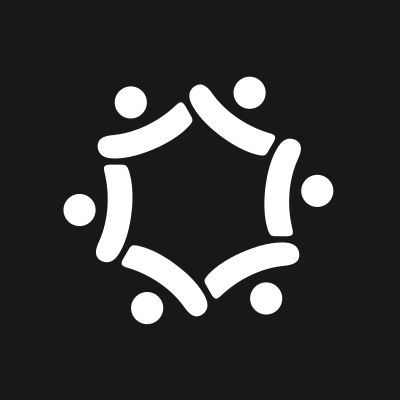
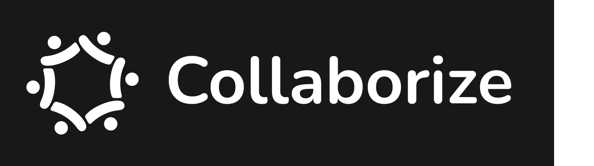

# Designsystem

Für die Anwendung zur Teamfindung wurde ein umfassendes Designsystem entwickelt, das sowohl die visuelle als auch die funktionale Gestaltung der Plattform prägt. Das Designsystem liefert die Grundlage ein einheitliches Interface aus den [Wireframes](../Milestone%203/Wireframes.md) zu erstellen. Dabei wurden Farben, Schriften und Abstände für ein einheitliches Erscheinungsbild definiert.

Das entwickelte Designsystem leitet sich aus Basis-Komponenten von [Tailwindcss](https://tailwindcss.com/) ab. Dabei können Änderungen an der Typografie, bei der Farbgebung, so wie bei Hintergründen, Buttons etc. vorgenommen werden.

## Farben

Das Farbschema der Plattform, wie in der untenstehenden Grafik dargestellt, greift auf eine harmonische Farbpalette mit Farbabstufungen zurück. Die "Primary Color" ist ein violetter Farbton, der häufig mit Kreativität in Verbindung gebracht wird. Da auch unsere Anwendung dazu anregen soll in eigenen Projekten kreativ zu werden und im Brainstorm-Bereich seine Ideen zu sammeln, erachteten wir diese Assoziation als sehr passend.
Die ausgewählten Farben bieten einen ausgewogenen Kontrast, um wichtige Elemente wie Buttons und Links hervorzuheben. 
Die weiteren aufgezeigten Farbvarianten sind bspw. für "success" oder "warning" Benachrichtigungen oder zeigen die Text- und Hintergrundfarben.

## Spacing

Die Spacing-Grafik verdeutlicht das Abstands- und Layoutsystem der Plattform, das für eine klare Struktur und Lesbarkeit sorgt. Einheitliche Abstände zwischen den UI-Elementen schaffen eine saubere, übersichtliche Oberfläche, die es den Nutzern erleichtert, sich auf das Wesentliche zu konzentrieren. Für Abstände zwischen Elementen wird sich primär an ein 4 Pixel Grid gehalten, dementsprechend sind alle Abstände (bis auf wenige Ausnahmen) ein mehrfaches von 4 Pixeln groß.

## Typografie

Die Typografie ist ein wesentlicher Bestandteil des Designs, der sowohl die Lesbarkeit als auch die visuelle Hierarchie unterstützt. Die Typografie-Grafik zeigt, wie verschiedene Schriftgrößen und -stile verwendet werden, um wichtige Informationen hervorzuheben und die Benutzer durch die Plattform zu führen. Wir haben uns für die Schrift "Rubik" in Regular und Medium (je nach Schriftschnitt) entschieden. Die Schrift orientiert sich auch an den Vorgaben von Tailwindcss.

## Logo

Das Logo der Plattform spielt eine zentrale Rolle in der Markenbildung. Es symbolisiert das Thema „Zusammenarbeit und Kreativität“, das Kernstück eines Projekts. Die Bildmarke stellt ein Team dar, das sich in einem Kreis / an einem Tisch berät. Die Wortmarke enthält zudem den Produktnamen "Collaborize". Dieser spielt besonders aufs Kollaborieren (also Zusammenarbeiten) in einem Projekt an. Dieses Branding verstärkt den Wiedererkennungswert der Plattform. Das entwickelte Logo gibt es in verschiedenen Versionen: nur die Bildmarke, die Wort-Bild-Marke und die beiden Varianten mit invertierten Farben (eine helle und eine dunkle Variante).

