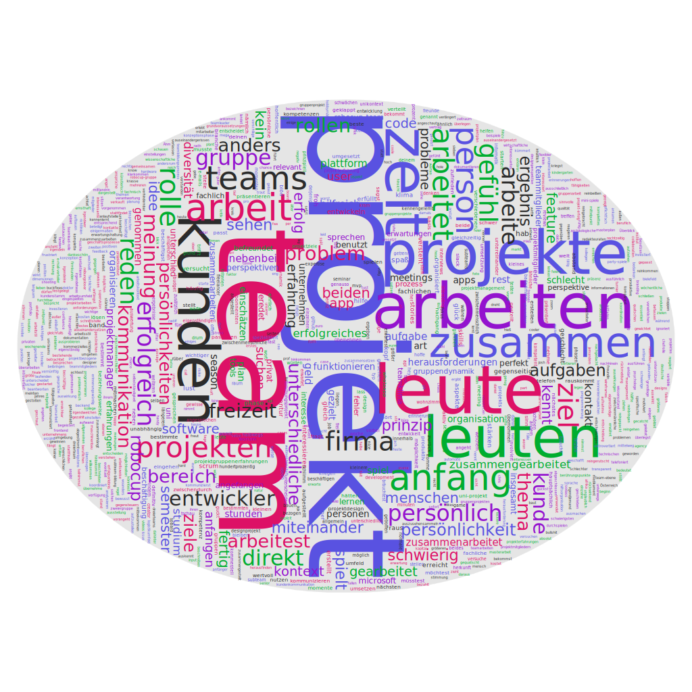

## Softwareentwickler/Student

- Gruppenprojekte in der Freizeit begrenzt
  - Bandmitgliedschaft, die aber nicht gut funktionierte, da die Gruppendynamik problematisch war
  - Ansonsten nur lose Freundesgruppen, die gemeinsame Aktivitäten planen
- Fehlende Selbstreflexion und Dominanzverhalten eines Teammitglieds führten zu Konflikten
- Offene Kommunikation und gegenseitiger Respekt wichtige Voraussetzungen für ein funktionierendes Team.
- Erfolgreiches Projektteam trotz anfänglicher Herausforderungen: Drei Subteams mit unterschiedlichen Persönlichkeiten fanden am Ende zusammen.
- Teamarbeit in Firma: Kleine Firma, alle arbeiten an gleicher Software, kennen sich gut, kommunizieren direkt, keine klassische Teamdynamik, aber funktioniert gut, da alle gut miteinander auskommen.
- Für ein eigenes Projekt: Leute aus eigenem Umfeld ansprechen, die thematisch passen und mit denen man gut zusammenarbeiten kann. 
- Teambildungsmaßnahmen wie Vorstellungsrunden und Selbsteinschätzungen können wertvoll sein, auch wenn sie zunächst befremdlich erscheinen.
  - Teambildung ist wichtig, aber nicht immer einfach. Schafft Zugehörigkeitsgefühl und Transparenz.
  - Schwierig, diese selbst zu organisieren, da man sich dann leicht als "krasser Leader" darstellt.
- Mischung aus bekannten und neuen Teammitgliedern bietet Vor- und Nachteile, je nach Projektanforderungen.
- Projekterwartungen müssen abgestimmt werden, um produktive Zusammenarbeit zu ermöglichen. 
  - Unterschiedliche Prioritäten erschweren die Zusammenarbeit, können aber überwunden werden.
- Persönliches Interesse am Projektziel ist wichtig.

## Designerin

- Gemeinsame Ziele und Schwerpunkte sind wichtig, gute Kommunikation dabei der Schlüssel
- Zwischenmenschlich "aushaltbar", damit es Spaß macht, am Projekt zu arbeiten
    - Spaß an der Arbeit ist wichtig für Motivation
- Es sollte immer einen Projektleiter/Moderator geben, schlechte Erfahrungen ohne
    - "...dass die Leute so auf ihre Meinung beharren und dann dreht man sich halt nur im Kreis."
- Unterschiedliche Persönlichkeiten gut für Kreativprojekte
    - Bevorzugt jedoch ähnliche Arbeitsweisen
- Lieber mit Leuten arbeiten, deren Arbeit man kennt
- Gute Erfahren mit "Mentoring", Projekt wo sie mit jemandem zusammenarbeitet, der schon Erfahrung hat
- Meetings in Präsenz besser als online
- Mitglieder für eigene Gruppenprojekte:
    - Freundeskreis
    - Arbeitskollegen
    - **Instagram-Communities für Designer**
        - **Leute laden ihre Projekte hoch und geben sich gegenseitig Feedback**
        - Sie nutzt es um Inspiration zu sammeln
- Vorgeschlagene Features für unsere Plattform: dass man auch Reviews lesen kann von der Person, wie die so arbeitet
    - "dass man halt so sich Reviews durchlesen kann, wie die Person so ist und so, dass man dann vielleicht auf unterschiedlichen Ebenen bewerten kann"
- Würde unsere Software gerne testen :)

## Selbstständiger Unternehmer

- Gute Zusammenarbeit sehr wichtig und wird durch Personen erreicht die sich gut ergänzen
- Teamklima ist A und O
- "solange die Personen produktiv sind, ist mir persönlich eigentlich relativ egal, wie die es machen"
- Für Projekt Leute gesucht, die Rollen ausfüllen, die sie besser können als er. Er managet eher
    - Jeder macht allerdings ein bisschen von allem
- Keine Konflikte, da reibungslose Zusammenarbeit
- Durch Werksstudentenstelle in sein Selbstständigkeits-Projekt gekommen
- **Nebenbei-Projekte sollten kommerzielles Ziel haben durch begrenzte Freizeit**
- Neue Mitglieder bisher nur über Freunde und Bekannte gefunden
    - Stellt sich Online-Plattform schwierig vor, **er würde vorher gerne die Leute interviewen**
    - Kennt keine zentrale Anlaufstelle
- Möchte auf Basis des Projekts ein Unternehmen mit 10-20 Mitarbeitern haben

## Leiter Forschungsprojekt

- Aufteilung der Arbeit in kleine Ziele
- Fokus auf Forschungsprojekte
    - "... nach Definition ist ein Forschungsprojekt immer erfolgreich"
- Für erfolgreiche Projekte "Die richtigen Leute und Kenntnisse bzw. dass man auch gewillt ist, neue Sachen zu lernen"
- **Gutes Team nicht am Erfolg ablesbar**
    - Ziel erreichen, dabei was lernen aber auch Spaß haben
    - Jeder sollte involviert sein
    - Gutes Arbeitsklima
    - **Man muss sich teilweise von Leuten trennen, um das Teamklima zu verbessern**
    - Größter "Erfolg" (Weltmeisterschaft) entstand mit Team mit schlechter Dynamik
    - "Also die letzte German Open, da hatten wir eigentlich als Gruppe richtig gut funktioniert, hatten aber trotzdem echt wenig Erfolg"
- Leute mit ähnlichen kulturellen Hintergründen arbeiten eher untereinander
- Kompetenzunterschied in Teams nicht gut, es sei denn die Leute sind gewillt zu lernen
- Lieber durchmischte Teams in Bezug auf Persönlichkeit
- Hat viele Ideen und ist daher nicht interessiert neuen Projekten beizutreten
- Neue Teammitglieder finden
    - durch googlen, Werbung in Kursen machen, (ex-) Mitarbeiter, mit Profs reden oder Fach-Events
    - Außerhalb der Uni über Insta oder Github
    - "Wir haben oft die Idee, irgendetwas Spezielles umzusetzen und gucken dann erstmal, ob wir überhaupt die Leute haben, um das zu machen."
- "Es gibt ja auch viele Gruppen, die wollen in Projekten arbeiten, ohne feste Ziele zu definieren und ohne feste Termine zu haben"
- Eher laizess-faire Arbeitsweise (Leute machen issues auf und irgendwer wird sich schon drum kümmern)

## Fazit
- Teamklima muss nicht mit Erfolg korrelieren
- Allgemein kein Portal bekannt um neue Teammitglieder zu finden, es gibt jedoch einzelne Fachcommunities (Fachmessen oder Instagram-Communities)

- Gemeinsamkeiten
    - Teamklima wichtig für Motivation
    - Bei Teammitgliedern mit unterschiedlichen Meinungen ist gute Kommunikation wichtig

- Unterschiede
    - Zielsetzung: Forschung vs. Kommerz
        - Im kommerziellen Bereich ist Erfolg relevanter als zwischenmenschliches
    - Ähnlichkeit der Teammitglieder: Persönlichkeit und Arbeitsweise
    - Projektleitung vs. Self-Management